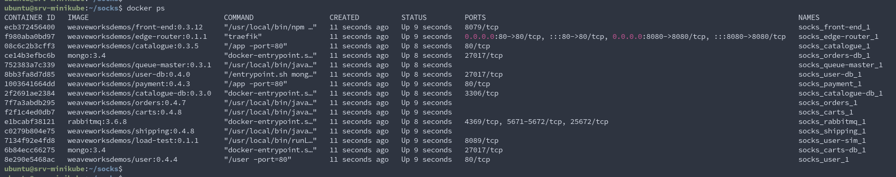
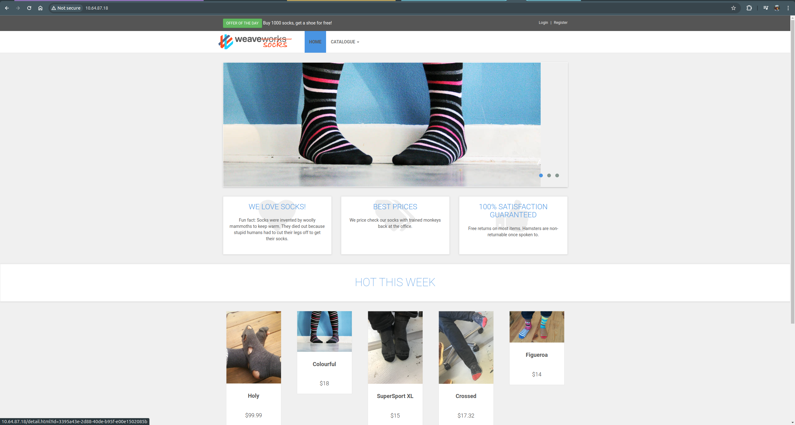
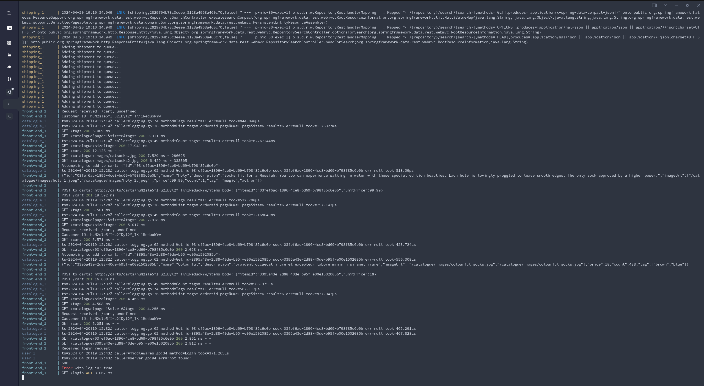
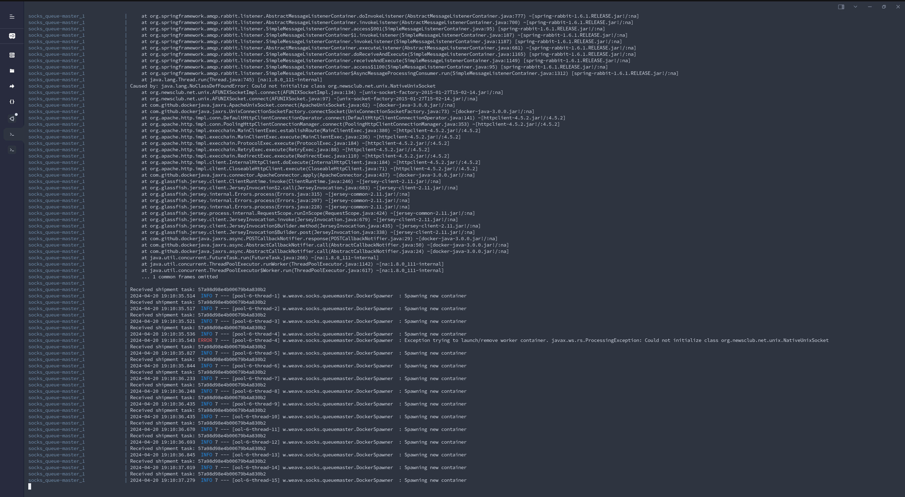

## Основы микросервисной архитектуры

#### сервисы успешно запущены (docker-compose ps).

#### локальная копия интернет-магазина, проект работает.

#### docker-compose logs -f
##### front-end_1

#### логи работы сервиса доставки и БД

